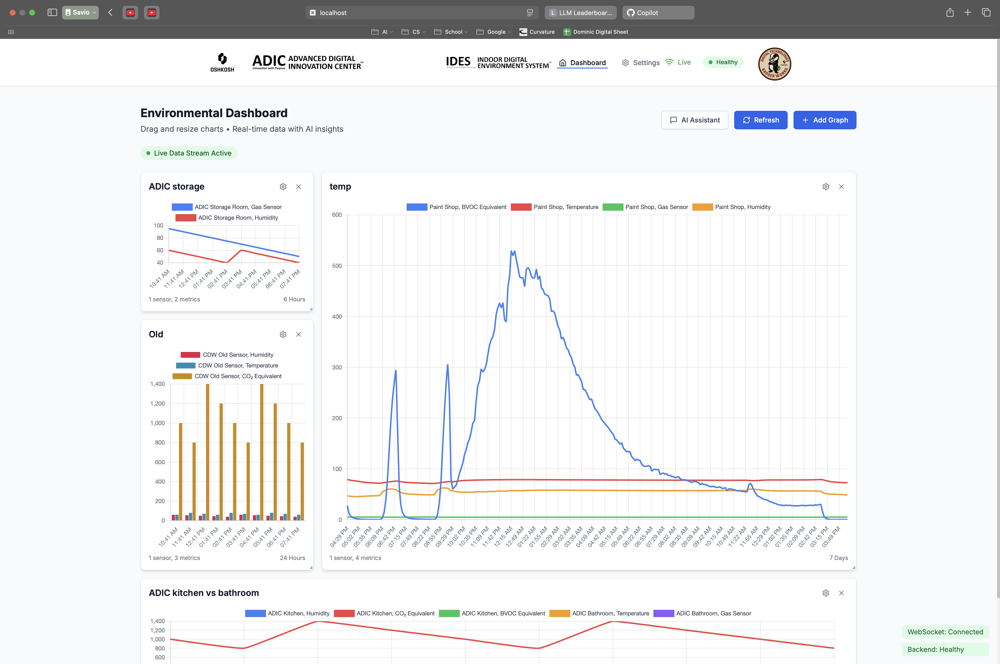
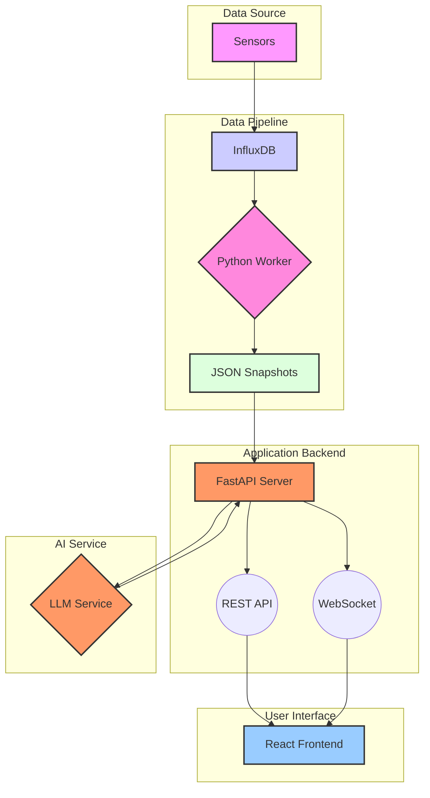

# IDES 2.0: Indoor Digital Environment System

IDES 2.0 transforms raw sensor data from your building into live, interactive charts and plain-English insights. Ask the system questions like, "What was the temperature and humidity yesterday?" or "Forecast CO₂ levels for the next week," and it will generate and display the relevant graphs, keeping them updated in real-time as new data arrives.



## ✨ Key Features

| Feature                  | Description                                                                                                                              |
| ------------------------ | ---------------------------------------------------------------------------------------------------------------------------------------- |
| **Sensor-Centric**       | Select sensors by MAC address or a friendly nickname. The entire experience is built around the data from individual sensors.              |
| **Live Charts**          | Graphs update in real-time without needing a page refresh, powered by WebSockets.                                                        |
| **Natural Language AI**  | Ask for data in plain English. A pluggable LLM service (local or OpenAI) provides answers and can generate charts on the fly.             |
| **Predictive Forecasting** | The AI can forecast future sensor readings and later compare its predictions against actual data, complete with accuracy scores (MAE/RMSE). |
| **Customizable Dashboard** | Drag, drop, and resize graph cards to create a personalized layout. Customize metrics, time ranges, and chart types for each graph.      |
| **Automated Data Purging** | Set a data retention period in the settings, and the system will automatically clean up old data.                                        |

## Effects and Proofs

### Energy Utilization
- HVAC is about 40% of a building's energy usage, and indoor sensors can save up to 20% in energy solely via temperature control by presence.
- Coordinating systems such as HVAC, blinds, etc. can equate to 30-50% savings, averaging about 2.37kWh/sqft, or enough power for 22 US homes annually.
- For example, Lockheed Martin completed 64 energy/environment efficiency projects in 2023, cutting 25 million kWh and $3.2 million in utility and maintenance costs annually.

### Worker Safety and Comfort
- The CDW sensors can record CO2, temperature, humidity, and BVOC, all of which can be optimized to reduce acute respiratory complaints, allowing workers to be more comfortable.
- A study found there were 42% less Sick Building Syndrome cases (occupants reporting acute health of comfort effects linked to time in a building, resulting in headaches, nausea, respiratory irritations, etc.) when IAQ was monitored and optimized.
- Amazon Fulfillment Centers rolled out IAQ sensors network-wide, resulting in 15% drop in heat stress incidents in peak summer months.

### Indoor Environment Analysis
- A Harvard/Syracuse study found that cognitive decision making declines by 15% when CO2 is at 945 parts per million (ppm), and declines 50% around 1400ppm. This shows evidence against the general design guidelines of around 1000ppm.
- Measuring and monitoring these values would allow us to optimize ventilation for maximum benefit and minimum drawbacks, in this case, cognitivity.

### Expanded Predictive Maintenance
- Temperature, humidity, and air quality can all play a part in giving the company data to optimize uptime of machinery and minimize wear. HVAC related or not, most machinery relies on environmental conditions (e.g. cooling, heating, moisture, etc.)
- The ADIC has already saved great amounts of money using IoT vibration sensors, but it can be enhanced.
- GM implemented temperature data in their manufacturing plants, and it saved over $20 million annually by reducing downtime by 15%.
- Honeywell used IAQ metrics in their buildings to triggerd automatic maintenance orders in their buildings, resulting in 25% fewer HVAC failures and services, saving millions of dollars annually.

## How Oshkosh Can Move Forward
- As a manufacturing company, investing into digital manufacturing is crucial to maintain uptime, minimize costs, and retain workers.
- We already have a good base for a unified data lake (Unified Namespace) and can integrate all types of technology to maximize throughput.
- The savings and benefits are clear from research and other company implementations.

## 🏗️ How It Works

The system is composed of a few key components that work together to collect, process, and visualize sensor data.



1.  **Sensors** collect environmental data.
2.  A **Python Worker** pulls data from **InfluxDB** every 30 seconds and stores it in weekly **JSON snapshots**.
3.  The **FastAPI Server** serves the data to the frontend via a **REST API** and pushes real-time updates through a **WebSocket**.
4.  The **React Frontend** visualizes the data in interactive charts.
5.  When you ask a question, the request is sent to an **LLM Service** (like a local Ollama instance or the OpenAI API) to be interpreted, which can result in a new chart being generated.

## 🚀 Getting Started

You can run IDES 2.0 locally for development or deploy it using Docker.

### Prerequisites

-   **Python 3.10+**
-   **Node.js 18+**
-   **pnpm** (`npm install -g pnpm`)
-   **Docker & Docker Compose** (for Docker-based setup)
-   **Make** (optional, but simplifies running commands)

### 1. Local Development (Recommended)

The quickest way to get everything running is to use the provided `Makefile`.

```bash
# Install dependencies, set up the environment, and start the servers
make setup && make dev
```

This command will:
1.  Create a Python virtual environment.
2.  Install all backend and frontend dependencies.
3.  Create a default `.env` configuration file.
4.  Start the FastAPI backend and the React frontend development servers.

Once running, you can access the application at:
-   **Frontend:** `http://localhost:5173`
-   **Backend API:** `http://localhost:8000`
-   **API Docs:** `http://localhost:8000/docs`

### 2. Docker Deployment

If you prefer to use Docker, you can use Docker Compose to manage the services.

```bash
# Build and run the development stack in Docker
make docker-dev

# For production
make docker-prod

# To run with a local LLM service (Ollama)
make docker-llm
```

### Useful Commands

The `Makefile` contains shortcuts for most common tasks.

-   `make help`: Show all available commands.
-   `make status`: Check the status of all services.
-   `make stop`: Stop all running services.
-   `make clean`: Remove all build artifacts and installed dependencies.

## 📁 Project Structure

The project is organized into two main parts: a Python backend and a React frontend.

```
├── backend/            # Python/FastAPI Application
│   ├── app/            # Core application code
│   │   ├── api/        # API endpoints and WebSocket logic
│   │   ├── workers/    # Background tasks (InfluxDB polling, data purging)
│   │   └── llm/        # LLM service integrations
│   └── data/           # Stored JSON data snapshots
│
└── frontend/           # React/TypeScript Application
    ├── public/         # Static assets (logos, etc.)
    └── src/            # Source code (components, pages, hooks)
```

## 🔧 Configuration & Customization

-   **Environment Variables**: The backend is configured through a `.env` file created by `make setup`. Here you can set API keys, database URLs, and other settings.
-   **Change Logos & Colors**: Modify files in `frontend/public/assets/` and `frontend/src/index.css`.
-   **Swap AI Engine**: Go to the **Settings** page in the application to switch between a local LLM and the OpenAI API.

## 🤝 Contributing

Pull requests are welcome! Please ensure your code is formatted (`make format`) and that you add tests for any new features.

---

**Maintainer:** Savio Jabbo · [sjabbo@oshkoshcorp.com](mailto:sjabbo@oshkoshcorp.com)
*Licensed under the OshKosh Restricted License.*
